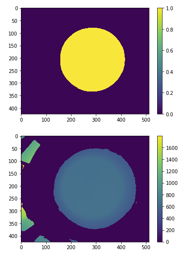
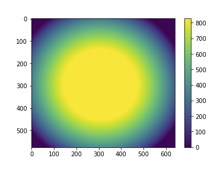
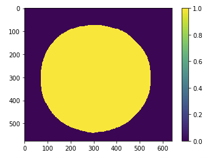
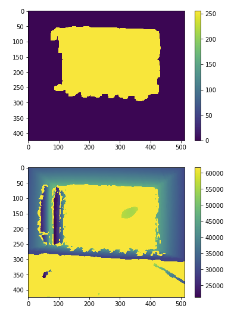
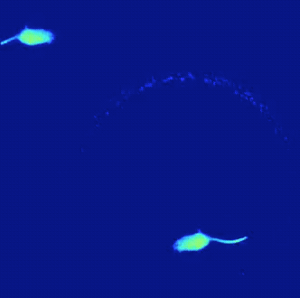

# MoSeq2-Extract: Depth Video Rodent-Tracking Toolkit
 
[](https://travis-ci.com/dattalab/moseq2-extract)
  
[](https://codecov.io/gh/dattalab/moseq2-extract)

Welcome to moseq2, the latest version of a software package for mouse tracking in depth videos first developed by Alex Wiltschko in the Datta Lab at Harvard Medical School.

Latest version is `0.5.0`

***

## Features
Below are the commands/functionality that moseq2-extract currently affords. 
They are accessible via CLI or Jupyter Notebook in [moseq2-app](https://github.com/dattalab/moseq2-app/tree/release).
```bash
Usage: moseq2-extract [OPTIONS] COMMAND [ARGS]...

Options:
  --version  Show the version and exit.  [default: False]
  --help     Show this message and exit.  [default: False]

Commands:
  aggregate-results   Copies all extracted results (h5, yaml, avi) files...
  batch-extract       Batch processes all the raw depth recordings located...
  convert-raw-to-avi  Converts/Compresses a raw depth file into an avi file...
  copy-slice          Copies a segment of an input depth recording into a...
  download-flip-file  Downloads Flip-correction model that helps with...
  extract             Processes raw input depth recordings to output a...
  find-roi            Finds the ROI and background distance to subtract
                      from...
  generate-config     Generates a configuration file that holds editable...
  generate-index      Generates an index YAML file containing all extracted...
```

### CLI Exclusive Functions
```bash
batch-extract       Batch processes all the raw depth recordings located...
convert-raw-to-avi  Converts/Compresses a raw depth file into an avi file...
copy-slice          Copies a segment of an input depth recording into a...
```

### GUI Exclusive Function
```bash
extract_found_sessions() Extracts all found data within a given input_dir, 
 AND searches for individual session configuration parameters in the session_config.yaml
```

Run any command with the `--help` flag to display all available options and their descriptions.

***

## Documentation

MoSeq2 uses `sphinx` to generate the documentation in HTML and PDF forms. To install `sphinx`, follow the commands below:
```.bash
pip install sphinx==3.0.3 sphinx_click==2.5.0
pip install sphinx-rtd-theme
pip install rst2pdf
``` 

All documentation regarding moseq2-extract can be found in the `Documentation.pdf` file in the root directory,
an HTML ReadTheDocs page can be generated via running the `make html` in the `docs/` directory.

To generate a PDF version of the documentation, simply run `make pdf` in the `docs/` directory.

For information on getting started, check out the [MoSeq Roadmap](https://github.com/dattalab/moseq2-docs/wiki).
***

## Examples

### Example `find-roi` Outputs

#### Round Arena ROI and Background

<br><br>

#### Y-Maze Arena (from Kinect v2 Camera)


#### Convex-shaped Bucket (\\_/) (from Azure Camera)
Dilated Background and ROI respectively.




#### Rectangular Arena (from RealSense)
ROI and Weighted Background Image respectively.



### Example Extraction



***

## Contributing

If you would like to contribute, fork the repository and issue a pull request.  
